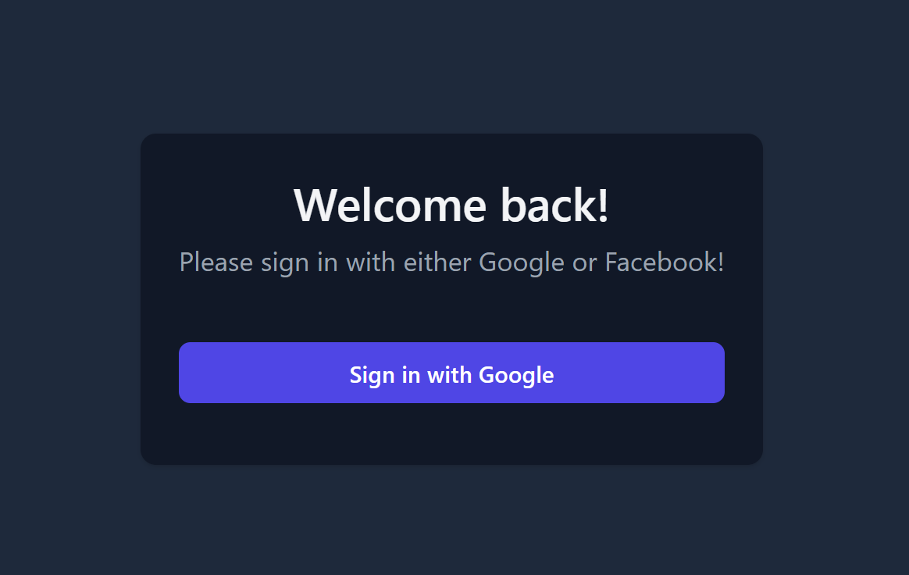
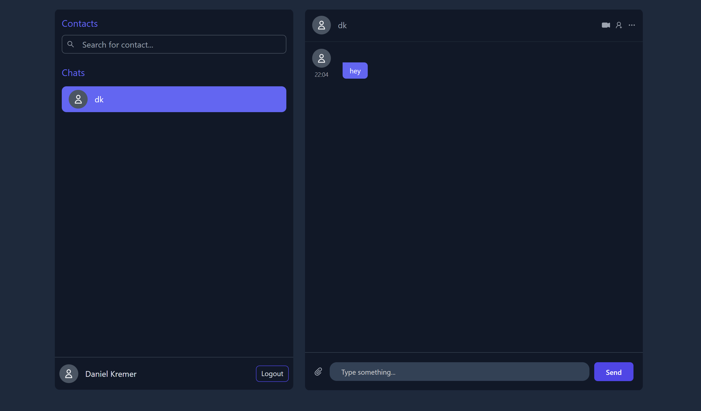

### `General information`

This is a Chat app developed in react.
In order to start, you need to create your own Firebase project and enable the google authentication as well as firestore.

Create a .env file in the root folder of this project and insert your firebase information like this:

```
REACT_APP_FIREBASE_API_KEY=YOUR API KEY
REACT_APP_FIREBASE_AUTH_DOMAIN=YOUR AUTH DOMAIN
REACT_APP_FIREBASE_PROJECT_ID=YOUR PROJECT ID
REACT_APP_FIREBASE_STORAGE_BUCKET=YOUR STORAGE BUCKET
REACT_APP_FIREBASE_MESSAGING_SENDER_ID=YOUR MESSAGING SENDER ID
REACT_APP_FIREBASE_APP_ID=YOUR APP ID
```

After you completed that run:

### `yarn install`

in order to install all packages and than

### `yarn start`

in order to start the chat app.

Runs the app in the development mode.\
Open [http://localhost:3000](http://localhost:3000) to view it in the browser.

The page will reload if you make edits.\
You will also see any lint errors in the console.

Log in with at least two users to be able to start a chat.
Search for the name of a user in the search area.
Chose a user you've found and start chatting.



